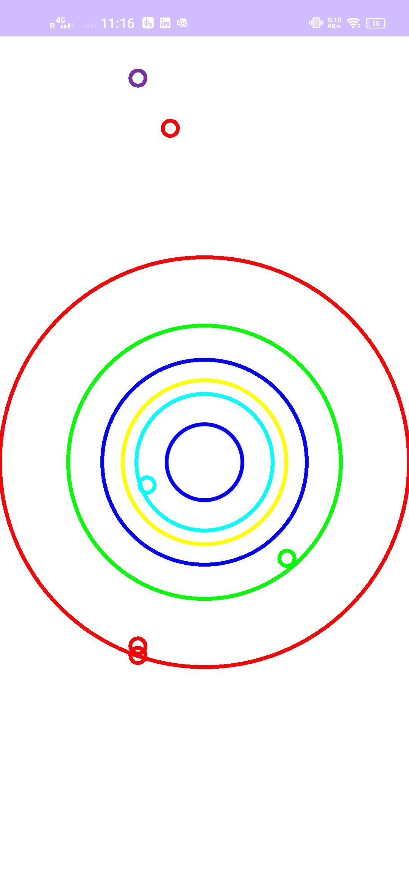

# Tilt-based Maze Game

Tilt-based Maze Game is an Android application where players navigate a ball through a maze by tilting their device. The game utilizes the device's accelerometer sensor to control the movement of the ball.


## Features

- **Tilt Controls:** Use device tilt to navigate the ball through the maze.
- **Customizable Maze:** Different levels with increasing difficulty.
- **Interactive Gameplay:** Real-time ball movement based on sensor input.
- **Visual Feedback:** Color-changing balls based on game progress.

## Installation

To use Tilt-based Maze Game on your Android device, follow these steps:

1. Clone the repository or download the latest release.
2. Install the APK file on your Android device.
3. Ensure device permissions are granted for accelerometer sensor usage.

## Usage

- **Tilt Controls:** Tilt your device to move the ball through the maze.
- **Navigate Levels:** Progress through different levels with increasing maze complexity.
- **Objective:** Reach the end of each maze level without touching the walls.

## Gameplay Screenshots

Include screenshots or GIFs showcasing different gameplay scenarios here.

## Development Environment

- **Android Studio:** Version jellyfish
- **Minimum SDK Version:** 34
- **Target SDK Version:** 34
- **Java Version:** 17

## Contributing

If you'd like to contribute to Tilt-based Maze Game, follow these steps:

1. Fork the repository.
2. Create a new branch (`git checkout -b feature/awesome-feature`).
3. Make your changes.
4. Commit your changes (`git commit -am 'Add awesome feature'`).
5. Push to the branch (`git push origin feature/awesome-feature`).
6. Create a new Pull Request.

## License

This project is licensed under the MIT License. See the [LICENSE](LICENSE) file for details.

## Acknowledgments

- Inspired by classic maze games and accelerometer-controlled applications.
- Special thanks to [Android Developers Documentation](https://developer.android.com) for guidance on sensor usage.


Instructions for Use
Clone the Repository:

Clone the repository using Git or download the latest release from the GitHub repository.
Install the APK:

Install the provided APK file on your Android device to play the Tilt-based Maze Game.
Permissions:

Ensure that necessary permissions are granted for accelerometer sensor usage on your device.

# Custom Progress Loader

Custom Progress Loader is an Android library that provides a customizable circular progress indicator view with animation capabilities.


## Features

- **Customizable:** Easily customize circle radius, stroke width, and colors.
- **Animated:** Smooth animation for transition between progress states.
- **Easy Integration:** Simple to integrate into any Android project.

## Installation

To use Custom Progress Loader in your Android project, follow these steps:

1. Clone the repository or download the latest release.
2. Add the `customprogressloader` module to your project.
3. Include `CustomProgressLoader` in your layout XML files.

## Usage

### XML Layout

```xml
<com.example.customprogressloader.CustomProgressLoader
    android:id="@+id/customProgressLoader"
    android:layout_width="wrap_content"
    android:layout_height="wrap_content"
    android:layout_centerInParent="true" />
```

## Java/Kotlin Code
    
```java
// Start animation
CustomProgressLoader customProgressLoader = findViewById(R.id.customProgressLoader);
customProgressLoader.setProgress(50); // Set progress to 50%
customProgressLoader.startAnimation(); // Start the animation
```

## Customization
You can customize the progress loader with the following attributes:

circleRadius: Radius of the circle (default: 100)
circleStrokeWidth: Width of the circle's stroke (default: 10)
circleColor: Color of the circle background (default: Color.LTGRAY)
progressColor: Color of the progress arc (default: Color.BLUE)
License
This project is licensed under the MIT License - see the LICENSE file for details.

## Acknowledgments
Inspired by Android Developers Documentation


### Instructions for Use

1. **Clone the Repository:**
    - Clone the repository using Git or download the latest release from the GitHub repository.

2. **Integrate `customprogressloader` Module:**
    - Add the `customprogressloader` module to your Android project by importing it.

3. **Include `CustomProgressLoader` in Layout XML:**
    - Insert `CustomProgressLoader` into your desired layout XML files.

### Example Usage

- **XML Layout:**
